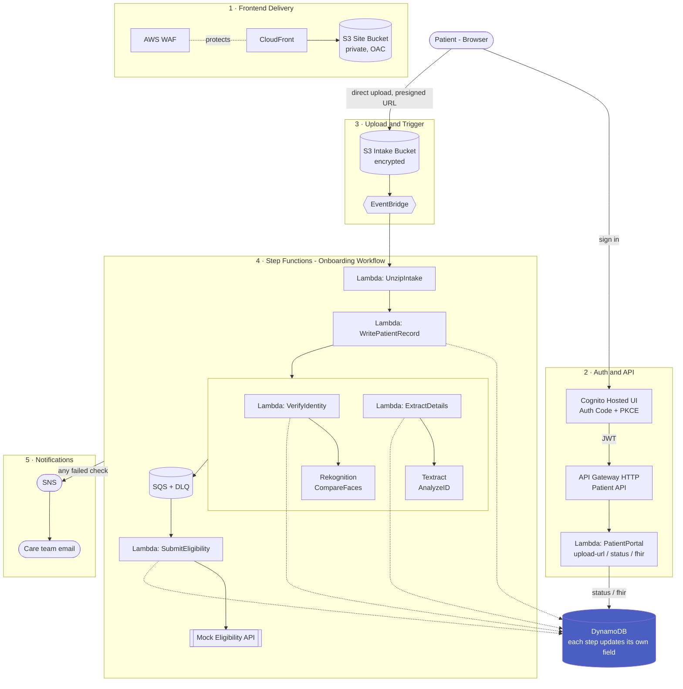

# 🏥 HealthLab Portal — Serverless Patient Onboarding

[](https://github.com/emmanuelfornah/healthlab-portal/actions/workflows/ci.yml)
[](LICENSE)
[](https://aws.amazon.com/serverless/sam/)
[](https://hl7.org/fhir/R4/)

Serverless patient onboarding on AWS that verifies patient identity, reconciles
intake details, and checks patient eligibility for lab test orders. A patient
signs in, uploads an intake bundle (intake form, ID document, selfie), and an
event-driven workflow runs those checks in parallel — establishing whether the
patient is eligible (insurance/coverage) before lab test orders proceed, then
records the outcome for the care team.

**🔗 Live demo:** https://healthlabportal.com

> **Scope & honesty note.** This is a portfolio/demonstration project. It
> follows HIPAA-aligned patterns (encryption at rest, least-privilege IAM,
> private storage, audit-friendly workflow) but is **not** a HIPAA-certified
> system and should not process real PHI. The insurance eligibility service is a
> **mock** stand-in for a real payer/clearinghouse API. Everything described
> below is implemented, tested, deployed, and verified end-to-end against the
> live stack; see [Testing](#testing) and [Deployment](#deployment).

---

## Architecture



## Roadmap

The strongest differentiator here is domain-specific, not infrastructure —
built on clinical laboratory experience, not a generic CRUD idea:

- **Duplicate & redundant lab-order detection.** Flag lab test orders that
  overlap in their component analytes so physicians avoid redundant draws and
  billing. Examples:
  - A glucose ordered separately when a **BMP** or **CMP** (which already
    include glucose) is also ordered.
  - A **BMP** later "upgraded" to a **CMP** — the CMP superset already contains
    the BMP analytes, making the earlier BMP redundant.
  - Overlapping panels ordered together (e.g. BMP + CMP, where CMP is a superset
    of BMP + LFT components).
  - **Time-based redundancy** — tests reordered within a clinically meaningless
    interval. For example, **HbA1c ordered again within 3 months**: A1c reflects
    roughly 90 days of average glycemia (red-cell lifespan), so a repeat inside
    that window adds cost without new clinical information.

  The intent is a rules service combining an **analyte-mapping** layer (resolve
  each panel to its component analytes to catch overlaps) with a **frequency**
  layer (flag reorders inside evidence-based minimum intervals) — reducing cost
  and duplicate specimen collection.
- **AWS HealthLake** as the production FHIR datastore (this build ships a
  FHIR R4 mapping layer; HealthLake would provide managed FHIR persistence and
  query APIs).
- **Automated end-to-end test in CI** — a scripted run against the live stack
  (Cognito test user → upload → poll status to a terminal state) on every
  push to `main`, closing the gap between "verified manually" and "CI
  verifies it on every deploy." See [SECURITY.md](SECURITY.md#known-limitations-tracked-honestly-not-silently-deferred)
  for the full list of tracked gaps and why each isn't closed yet.

## Why serverless, not EC2/EKS

Lambda + Step Functions was chosen over ECS/EC2 because the workload is
bursty and event-driven — a patient submits once, the workflow runs once,
then compute goes to zero. Paying per-execution rather than per-hour is the
correct pricing model for this traffic pattern: there's no steady request
rate to justify an always-on container or a cluster control plane, and the
five-step onboarding workflow maps directly onto Step Functions' branching
and retry semantics instead of needing to hand-roll that orchestration in
application code.

## Tech stack

| Layer | Technology |
|---|---|
| Frontend | React 19 + Vite (single-page patient portal) |
| Frontend hosting | S3 (private) + CloudFront (Origin Access Control) |
| Auth | Amazon Cognito User Pool + Hosted UI (Authorization Code flow + PKCE) |
| API | Amazon API Gateway (HTTP API) with a Cognito JWT authorizer |
| Compute | AWS Lambda (Python 3.13), 7 functions |
| Orchestration | AWS Step Functions (parallel validation branches) |
| Identity / OCR | Amazon Rekognition (face match), Amazon Textract (AnalyzeID) |
| Eventing | Amazon EventBridge (S3 → Step Functions) |
| Messaging | Amazon SQS (+ dead-letter queue), Amazon SNS |
| Storage | Amazon S3 (encrypted, private), Amazon DynamoDB |
| IaC | AWS SAM |
| CI/CD | GitHub Actions, OIDC-authenticated deploy (no stored AWS credentials) |
| Observability | AWS X-Ray active tracing, structured logs (Lambda Powertools) |
| Testing | pytest, moto, Hypothesis (property-based) |

## Repository layout

```
healthlab-portal/
├── .github/workflows/
│   └── ci.yml                        # lint, test, build, then OIDC deploy to AWS on main
├── backend/
│   ├── template.yaml                 # SAM stack (all AWS resources)
│   ├── statemachine/
│   │   └── onboarding_workflow.asl.json
│   ├── src/
│   │   ├── unzip/                    # extract intake bundle
│   │   ├── write_patient_record/     # parse intake CSV → DynamoDB
│   │   ├── verify_identity/          # Rekognition: selfie vs ID
│   │   ├── extract_details/          # Textract: ID vs intake form
│   │   ├── submit_eligibility/       # SQS-triggered eligibility check
│   │   ├── validate_eligibility/     # mock eligibility API (HTTP)
│   │   └── patient_portal/           # Cognito-protected patient API
│   └── tests/                        # unit + property tests
└── frontend/
    ├── src/
    │   ├── auth.js                   # Cognito Hosted UI code flow
    │   ├── api.js                    # Patient API client (JWT)
    │   └── App.jsx                   # sign in → upload → status
    └── ...
```

## Onboarding workflow

1. A patient signs in through the Cognito Hosted UI; the SPA exchanges the
   authorization code for a JWT.
2. The SPA calls `POST /intake/upload-url` (JWT-authorized) and receives a
   short-lived presigned S3 URL and an `intake_id`.
3. The patient's browser uploads the intake ZIP directly to S3 under `intake/`.
4. The S3 upload emits an EventBridge event that starts the Step Functions
   execution.
5. The workflow unzips the bundle, writes the patient record, then runs two
   checks in parallel — Rekognition identity match and Textract detail
   reconciliation — before submitting an eligibility check via SQS.
6. Each check updates the DynamoDB record; failures publish an SNS notification
   for manual review. The patient can poll `GET /intake/{id}/status`.

The intake bundle contains exactly three files:
`<intake_id>_intake.csv`, `<intake_id>_id.png`, `<intake_id>_selfie.png`.

## Local development

### Backend

```bash
cd backend
python -m venv .venv && .venv/Scripts/activate      # or source .venv/bin/activate
pip install -r tests/requirements.txt
sam validate --lint          # validate the template
pytest                       # run unit + property tests
```

### Frontend

```bash
cd frontend
cp .env.example .env         # fill in after deploying the backend
npm install
npm run dev                  # http://localhost:5173
npm run lint
npm run test
```

Frontend environment variables (`.env`):

```
VITE_PATIENT_API_URL=      # PatientApiEndpoint output
VITE_COGNITO_DOMAIN=       # CognitoHostedUiDomain output
VITE_COGNITO_CLIENT_ID=    # CognitoUserPoolClientId output
VITE_REDIRECT_URI=http://localhost:5173/
```

## Testing

Backend tests run without any AWS account — AWS calls are mocked with `moto`,
and the eligibility mock is covered with property-based tests (Hypothesis) that
assert invariants across generated inputs.

| Suite | What it covers |
|---|---|
| `tests/unit/test_unzip.py` | intake extraction + file-count validation |
| `tests/unit/test_write_patient_record.py` | CSV → DynamoDB record, preserves patient ownership on merge |
| `tests/unit/test_validate_eligibility.py` | eligibility mock responses |
| `tests/unit/test_patient_portal.py` | auth gate, presigned URL, status/FHIR lookups scoped to the requesting patient |
| `tests/unit/test_extract_details.py` | Textract field reconciliation, including the empty-extraction edge case |
| `tests/unit/test_verify_identity.py` | Rekognition face-match verification and failure handling |
| `tests/unit/test_submit_eligibility.py` | overall STATUS rollup (APPROVED/NEEDS_REVIEW) from the three check results |
| `tests/unit/test_fhir.py` | FHIR R4 Patient/Coverage mapping |
| `tests/property/test_eligibility_properties.py` | eligibility invariants (Hypothesis) |

All 34 tests pass locally; `sam validate --lint` passes; the frontend builds,
lints clean, and its auth tests pass. The full pipeline has also been driven
end-to-end against the live deployment (Cognito login → S3 upload → Step
Functions execution → status/FHIR lookup), not just unit-tested.

## Security notes

- Cognito JWT authorizer protects the patient API; the patient identity is read
  from verified token claims, and every record lookup (`/status`, `/fhir`) is
  scoped to that patient — a mismatched owner returns 404.
- The frontend's OAuth Authorization Code flow uses PKCE (S256), so a leaked
  authorization code alone isn't redeemable for tokens.
- S3 intake bucket is private (all public access blocked) and encrypted at rest;
  uploads use short-lived presigned URLs.
- The frontend is served from a private S3 bucket through CloudFront via
  Origin Access Control — no public bucket access.
- Each Lambda uses a scoped IAM role (S3, DynamoDB, Rekognition, Textract, SNS,
  SQS) — no wildcard admin access, no long-lived credentials in code.
- No secrets or AWS account identifiers are committed to the repository.

## Deployment

The stack deploys via GitHub Actions
([`ci.yml`](.github/workflows/ci.yml)) — a single pipeline where the deploy
jobs run only after both CI jobs pass on a push to `main` (never on a PR),
and only when `backend/`, `frontend/`, or the workflow file itself actually
changed, so a docs-only commit doesn't trigger a pointless redeploy.
Authentication uses GitHub's OIDC provider — the workflow assumes an IAM
role scoped to this exact repository, with no
long-lived AWS credentials stored anywhere. The backend job runs
`sam build && sam deploy`; the frontend job builds against the live stack's
outputs and syncs to S3 + CloudFront.

Live at **[healthlabportal.com](https://healthlabportal.com)** — Route 53 +
a DNS-validated ACM certificate + CloudFront, currently backing a `dev`
environment stack. The Patient API is likewise served from
**api.healthlabportal.com** (a regional API Gateway custom domain,
DNS-validated ACM cert) rather than a raw `*.execute-api.*.amazonaws.com`
URL.

## Author

**Emmanuel Fornah** — AWS Cloud Application Developer (healthcare & serverless)

AWS Certified: Developer – Associate · Solutions Architect – Associate · AI Practitioner · Cloud Practitioner
· HashiCorp Terraform Associate

[Credly](https://www.credly.com/users/emmanuel-fornah) · [GitHub](https://github.com/emmanuelfornah)

## License

MIT
